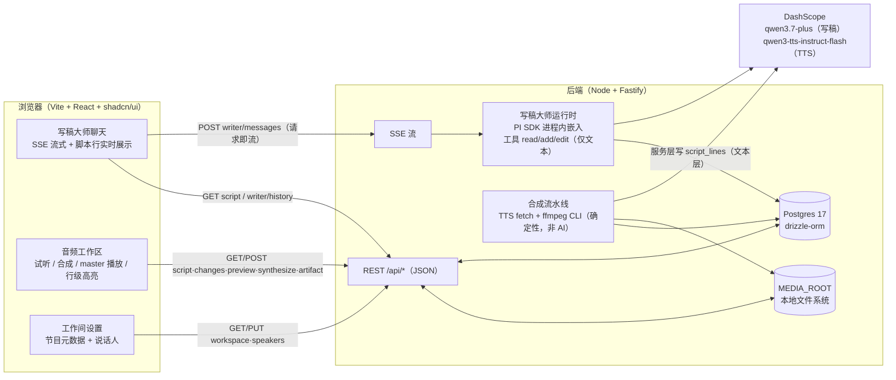
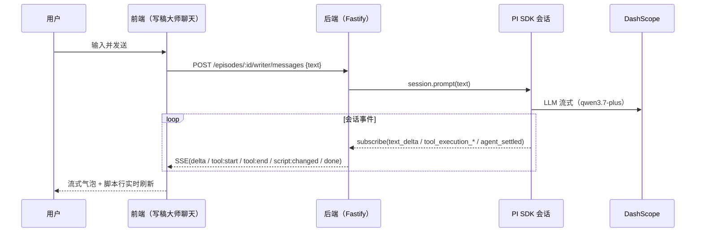
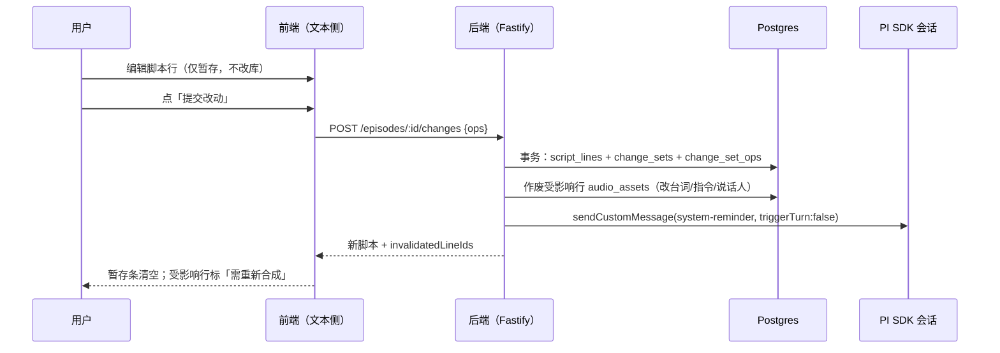
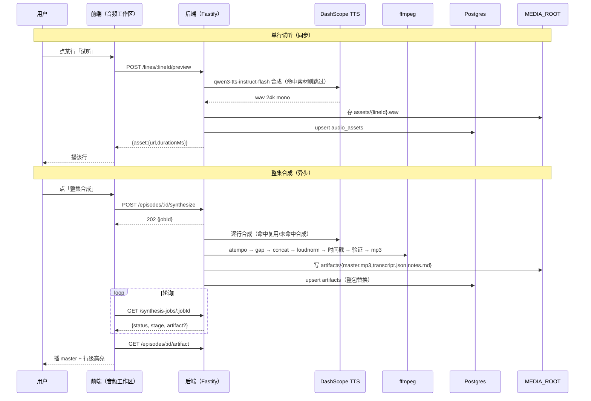

# 前后端接口与数据流（REST + SSE + 前端消费）

> 决议来源：[#19 前后端接口与数据流（REST + SSE + 前端消费）](https://github.com/clerimia/AIPodCast/issues/19)（wayfinder 地图 #14）。
> 上界：写稿大师够不到音频素材与后期参数（ADR-0005）；试听 = 单行合成入口；合成 = 确定性流水线非 AI 会话。
> 本文档是**接口与数据流方案**（计划层，plan not do），给实现阶段开工用；落地时以本文 + drizzle schema + PI SDK 配方为准。

## 一句话

前后端用一组 **REST（`/api/*`，JSON）** 承载所有可寻址状态与动作，唯一例外是**写稿大师会话流**，用 **SSE（`text/event-stream`）** 把 PI SDK `session.subscribe` 的事件转成浏览器事件词汇。前端三块（写稿大师聊天 / 音频工作区 / 工作间设置）各自只消费自己那一组端点与事件，互不越界。

## 组件与总数据流



要点：

- **写稿大师会话是唯一 AI 会话**（ADR-0005），其工具面只有 `read`/`add`/`edit`，只写 `script_lines` 的文本层（说话人/台词/指令），**够不到 `audio_assets`、`post`（停顿/语速）、`artifacts`**。
- **合成是确定性流水线**（ADR-0007）：读脚本 → 逐行取/合成音频素材 → ffmpeg 拼接/响度/编码 → 写产物。**不进 PI SDK、不是会话**。
- 数据库是真相源；SSE 只是把「会话在干什么」实时告诉前端，前端最终以 `GET script` 为准（ADR-0002）。

## 通用约定

- Base：`/api`；除媒体流外一律 JSON。
- ID：`uuid`；脚本行额外有 `serial`（L001…，既是序列号也是顺序，插入/重排按序重编）。
- 错误形状：`{ "error": { "code": string, "message": string } }`（`code` 如 `NOT_FOUND` / `CONFLICT` / `SYNTH_FAILED`）。
- 媒体流（素材/产物文件）用 `GET /api/media/...` 流式返回，**支持 HTTP `Range`**（`<audio>` 拖动进度需要）；`Content-Type` 按扩展名（`audio/wav` / `audio/mpeg` / `application/json` / `text/markdown`）。
- 单用户本地工作间，MVP **无鉴权**、不暴露公网；开发期前端经 Vite dev proxy 把 `/api` 反代到后端端口，生产同源托管。

## REST 端点清单

### 工作间与单集（脚手架 + 工作间设置）

| 方法 | 路径 | 说明 |
|---|---|---|
| GET | `/api/workspaces` | 列工作间 |
| POST | `/api/workspaces` | 建工作间（`{ name }`，连带 `show_metadata` 默认行） |
| GET | `/api/workspaces/:wsId` | 工作间详情：`show_metadata` + `speakers`（工作间设置页一次拉全） |
| PUT | `/api/workspaces/:wsId/show-metadata` | 更新节目元数据（大纲/主题/口吻/术语/禁词/节目简介/创建时间） |
| GET | `/api/workspaces/:wsId/speakers` | 列说话人 |
| POST | `/api/workspaces/:wsId/speakers` | 建说话人（`{ name, persona, gender, voice }`，voice 为 24 系统音色名之一） |
| PATCH | `/api/workspaces/:wsId/speakers/:speakerId` | 改说话人（名称/人设/性别/音色） |
| DELETE | `/api/workspaces/:wsId/speakers/:speakerId` | 删说话人；被 `script_lines` 引用时 `409 CONFLICT`（改绑后删） |
| GET | `/api/workspaces/:wsId/episodes` | 列单集 |
| POST | `/api/workspaces/:wsId/episodes` | 建单集（`{ title }`；连带 `conversations(kind=writer)` 行 + `post_rules` 默认 中/正常） |

> 说话人字段 `persona`/`gender` 来自 #17（说话人实体增人设/性别）；写稿上下文只取名称+人设，音色只在合成时经说话人取用。

### 单集与脚本（写稿大师文本侧 + 暂存/确认门）

| 方法 | 路径 | 说明 |
|---|---|---|
| GET | `/api/episodes/:episodeId` | 单集详情：`title`、`show_notes`（单集简介活字段）、`post_rules`、产物摘要 |
| PATCH | `/api/episodes/:episodeId` | 改 `title` / `show_notes`（单集简介，ADR-0009 源头活字段） |
| GET | `/api/episodes/:episodeId/script` | 读当前脚本（过滤 `deleted`、按 `serial`）：`{ lines: [...] }` |
| POST | `/api/episodes/:episodeId/changes` | **暂存/确认门**：把用户暂存的改动一次性提交（见下） |

脚本行形状（`GET script` 每行）：

```jsonc
{
  "id": "uuid",                 // Agent read/add/edit 引用，永不变
  "serial": "L001",             // 行号，既是序列号也是顺序
  "speakerId": "uuid",
  "speakerName": "主持人",
  "text": "台词",
  "instructions": "用沉稳的语气说",  // 自然语言"怎么说"，引擎 input.instructions
  "post": { "pause": "中", "speed": "正常" },   // 逐行后期覆盖；空=用集级 post_rules
  "asset": { "has": false, "durationMs": null } // 该行当前素材状态（供试听/合成命中判断）
}
```

`POST /changes` 请求体（暂存改动合并成一次提交，ADR-0003）：

```jsonc
{
  "ops": [
    { "op": "add",     "afterLineId": "uuid|null", "speakerId": "uuid", "text": "…", "instructions": "…" },
    { "op": "edit",    "lineId": "uuid", "patch": { "speakerId": "uuid", "text": "…", "instructions": "…" } },
    { "op": "delete",  "lineId": "uuid" },
    { "op": "reorder", "lineIds": ["uuid", "uuid", "…"] }
  ],
  "summary": "可选的一句话提交说明"
}
```

`POST /changes` 后端在一个事务里：

1. 应用 `ops` 到 `script_lines`（删除 = `deleted=true`，id 永不复用；插入/重排按序重编 `serial`）。
2. 写 `change_sets` + `change_set_ops`（一提交一条 ChangeSet）。
3. **作废受影响行的音频素材**（改台词/改指令/换说话人 → 删 `audio_assets` 对应行；改停顿/语速不在此路径，见下）。
4. 若写稿会话已存在且 idle，`session.sendCustomMessage({ customType:"change_set", display:false, content:"<system-reminder>脚本已更新（本次提交）：…</system-reminder>" }, { triggerTurn:false })`（#17 / ADR-0002：只追加不触发回合）。

响应：新脚本 + `{ "changeSetId": "uuid", "invalidatedLineIds": ["uuid", …] }`（前端据此给行标「需重新合成」）。

> 并发守卫（`base_version` 乐观锁）本期不做（单用户，地图 #14 出界）；`change_sets.base_version` 仅作顺序计数，不拒绝冲突。

### 后期参数（直接写，不经确认门）

停顿/语速是**拼接层参数**（ADR-0004），改它们只重拼接、不重写素材、不污染 AI 上下文，因此**不进暂存/确认门**，也不追加 ChangeSet：

| 方法 | 路径 | 说明 |
|---|---|---|
| PATCH | `/api/episodes/:episodeId/post-rules` | 集级默认：`{ "pause": "短|中|长", "speed": "慢|正常|快" }` |
| PATCH | `/api/episodes/:episodeId/lines/:lineId/post` | 逐行覆盖：`{ "pause"?, "speed"? }`，字段给 `null` 清除该行覆盖 |

### 试听 / 整集合成 / 产物

| 方法 | 路径 | 说明 |
|---|---|---|
| POST | `/api/episodes/:episodeId/lines/:lineId/preview` | **试听 = 单行合成**（同步）。命中素材直接返回，未命中走 TTS 合成并回填 `audio_assets` |
| POST | `/api/episodes/:episodeId/synthesize` | **整集合成**（异步）：确定性流水线 → 替换产物，返回任务句柄 |
| GET | `/api/synthesis-jobs/:jobId` | 合成任务状态（前端轮询） |
| GET | `/api/episodes/:episodeId/artifact` | 最新产物元数据 + 行级文稿（播放器据此高亮） |
| GET | `/api/media/:wsId/:episodeId/assets/:lineId` | 单行素材 wav（试听播放） |
| GET | `/api/media/:wsId/:episodeId/artifacts/:file` | 产物文件：`master.mp3` / `transcript.json` / `notes.md` |

- `preview`：同步阻塞（单次 TTS 网络调用，秒级）。命中 = 已有 `audio_assets` 行（改台词/改指令已作废的行视为未命中）。`{ "force": true }` 强制重新生成（ADR-0006 显式重写）。返回 `{ "asset": { "id", "url", "durationMs" } }`。与批量共用同一条合成函数、同一份 `audio_assets`（ADR-0006：试听 = 单行合成入口）。
- `synthesize`：**异步**（N 次 TTS + ffmpeg，分钟级）。返回 `202 { "jobId", "statusUrl" }`。后端跑 ADR-0007 全量管线（逐行 atempo → 插 gap → concat → loudnorm 两遍 → 时间戳 → 验证 → 编码 mp3），验证失败保留旧产物、任务置 `failed`。
- `GET /synthesis-jobs/:jobId` 返回：

```jsonc
{
  "status": "pending|running|succeeded|failed",
  "stage": "tts|post|encode|verify",   // 最小进度：只报阶段，不做细粒度
  "doneLines": 12, "totalLines": 40,
  "artifact": { /* 与 GET artifact 同形，succeeded 时 */ },
  "error": null
}
```

> 长时间任务的**细粒度进度与取消交互**留 [合成任务进度与取消交互](https://github.com/clerimia/AIPodCast/issues/22)；本文只定最小轮询形状，作为 #22 的起点。

- `GET /artifact` 返回：`{ id, createdAt, durationMs, size, audioUrl, transcriptUrl, notesUrl, transcript: [{ serial, speakerName, text, startMs, endMs }], notes: "单集简介文本或 null" }`。行级文稿是**快照**（ADR-0008），播放器一次读全量，不回 DB 按行查。

### 写稿大师会话（SSE）

| 方法 | 路径 | 说明 |
|---|---|---|
| POST | `/api/episodes/:episodeId/writer/messages` | 发用户消息，**响应即 SSE 流**（见下节） |
| POST | `/api/episodes/:episodeId/writer/abort` | 中止当前 run（`session.abort()`） |
| GET | `/api/episodes/:episodeId/writer/history` | 页面重载时回放会话历史（解析 session JSONL） |

- `POST writer/messages`：请求体 `{ "text": "…" }`。后端 `session.prompt(text)`，把 `session.subscribe` 的事件映射成浏览器事件词汇后以 `text/event-stream` 返回，直到 `done`（`agent_settled`）才结束流。
- **会话生命周期**：一集一会话（ADR-0005）。会话 id = episodeId（PI SDK `SessionManager.create(cwd, dir, { id: episodeId })` 确定性映射），`session.sessionFile` 存 `conversations.session_file`（#16 配方）。**首次** `writer/messages` 时懒创建会话文件；后续调用 `SessionManager.open(session_file)` 恢复。
- **history**：`messages` 表本期不建，历史在 JSONL 里。后端读 `session.sessionFile` 解析成浏览器友好列表（`[{ role:"user"|"assistant", text, toolCalls?:[{tool, summary}] }]`）返回。`change_set` 自定义消息（`display:false`）不回放进聊天流。条目结构实现时按 `SessionEntry`（`entry_appended` 事件的 payload）对齐。

## SSE 事件协议

浏览器事件词汇（`event:` 字段），后端负责把 PI SDK 事件翻译过去。前端**只认这套词汇**，不依赖 PI 事件名。

| 浏览器 SSE 事件 | PI SDK 事件来源 | 关键字段 | 前端消费 |
|---|---|---|---|
| `run:start` | `agent_start` | `{ turnId? }` | 进入「生成中」态，禁用输入框 |
| `delta` | `message_update` 且 `assistantMessageEvent.type === "text_delta"` | `{ delta: string }` | 追加到当前 assistant 气泡 |
| `message:end` | `message_end`（或 `turn_end.message`） | `{ text }` | 定稿当前气泡 |
| `tool:start` | `tool_execution_start` | `{ toolCallId, tool: "read"\|"add"\|"edit" }` | 显示状态条「正在读/写脚本…」 |
| `tool:end` | `tool_execution_end` | `{ toolCallId, tool, ok, isError, summary }` | 清状态条；`tool ∈ {add,edit}` 时触发脚本面板刷新 |
| `script:changed` | 后端派生：每次 `tool_execution_end` 且 `tool ∈ {add,edit}` 后发出 | `{ lineIds: ["uuid", …] }` | 脚本行列表**重新拉取** `GET script`（DB 是真相源） |
| `turn:end` | `turn_end` | `{ }` | 回合边界（清空临时态） |
| `done` | `agent_settled`（比 `agent_end` 更「最终」，无后续重试/压缩） | `{ }` | 关流、恢复输入框、最终拉一次脚本 |
| `error` | `agent_end`（`willRetry:false`）或 `tool_execution_end`（`isError:true`）或后端异常 | `{ message }` | 显示错误、关流 |

映射规则（来自 `docs/research/pi-sdk-embedding-recipe.md`，当前在 `research/pi-sdk-embedding` 分支）：

- 正文增量取 `message_update.assistantMessageEvent`：`text_start`（开气泡，隐式）→ `text_delta`（发 `delta`）→ `text_end`（发 `message:end`）。
- `tool_execution_*` 是顶层事件，`toolName` 只可能是 `read`/`add`/`edit`（`noTools:"builtin"` + 仅三个 `customTools`）。
- 终止用 `agent_settled`（会话层，覆盖 `agent_end` 后仍可能的重试/压缩）；`agent_end.willRetry` 为 false 且有错误时发 `error`。
- `thinking_delta`：写稿 LLM 默认 `enable_thinking=false`，不转发；若将来开思考可在此词表补 `thinking:delta`。
- 其余会话级事件（`queue_update`/`compaction_*`/`auto_retry_*`）MVP 不转发，留给实现阶段按需。

## 前端三块消费方式

### 1. 写稿大师聊天（SSE 流式 + 脚本行实时展示）

- 进入页面：`GET /episodes/:id/script`（脚本行列表）+ `GET /episodes/:id/writer/history`（历史气泡）并行拉取。
- 发消息：`POST /episodes/:id/writer/messages`，用 `fetch` + `ReadableStream` 读 `text/event-stream`：
  - `delta` → 追加气泡；`tool:start/tool:end` → 状态条；`script:changed` → **防抖**重拉 `GET script` 刷新脚本行列表；`done` → 关流、恢复输入。
- 「停止」：`POST /episodes/:id/writer/abort`。
- 脚本行面板 = 同一页面文本侧（上半区），是 `GET script` 的投影；用户直接编辑行 → 进暂存态（不改库），点「提交改动」走 `POST /changes`。

### 2. 音频工作区（试听 / 合成 / master 播放 + 行级高亮）

- 脚本行列表下方每行一个「试听」：`POST /lines/:lineId/preview`，成功后用返回 `url` 播单行 wav；行上显示「需重新合成」标记（来自 `GET script` 的 `asset.has` 与 `POST /changes` 返回的 `invalidatedLineIds`）。
- 每行停顿/语速下拉 + 集级默认：`PATCH /lines/:lineId/post`、`PATCH /post-rules`（即时生效，只重拼接）。
- 「整集合成」：`POST /synthesize` 拿 `jobId`，轮询 `GET /synthesis-jobs/:jobId`（`pending→running→succeeded/failed`）；`succeeded` 后 `GET /artifact` 拿 master + transcript。
- master 播放：`<audio src=audioUrl>` 播 `master.mp3`；按 `transcript`（`startMs/endMs`）在 `timeupdate` 里高亮当前行。

### 3. 工作间设置（节目元数据 + 说话人）

- 进入：`GET /workspaces/:wsId` 一次拉 `show_metadata` + `speakers`。
- 节目元数据表单：`PUT /workspaces/:wsId/show-metadata`。
- 说话人增删改：`POST/PATCH/DELETE /workspaces/:wsId/speakers/*`；删除被引用的说话人收到 `409` 后引导先改绑脚本行。
- 本块不碰脚本、不碰音频、不碰会话。

## 关键数据流时序

### 写稿大师会话（SSE）



### 用户修改 + 暂存确认门



### 试听（同步）与整集合成（异步）



## 与 ADR / 边界的对齐

- **ADR-0005**：写稿大师工具面仅 `read`/`add`/`edit`，只写文本层；`post`（停顿/语速）、`audio_assets`、`artifacts` 对 AI 不可见——本方案里这些只有 REST（用户侧）可达，工具实现走的服务层函数不暴露给 AI。
- **ADR-0001/0006**：脚本是活单层文本；改台词/指令/说话人 → `POST /changes` 作废该行素材；试听与批量共用同一素材。
- **ADR-0003**：文本改动走 `POST /changes` 确认门；停顿/语速是后期参数，直接 `PATCH`、不经门。
- **ADR-0002**：提交改动以一条 `<system-reminder>` ChangeSet 追加进会话（`triggerTurn:false`）；工具发起的修改走工具返回、不追加。
- **ADR-0007**：合成端点背后是确定性流水线，失败保留旧产物；`GET artifact` 读的是产物快照。
- **ADR-0008**：文件经 `GET /api/media/...` 流式读取，支持 Range；DB 不存二进制。
- **ADR-0009**：单集简介 = `episodes.show_notes` 活字段（`PATCH /episodes/:id`），合成时快照进 `notes.md`，MVP 不自动生成。

## 实现阶段验证项（未确证 / 待验证）

1. PI SDK 对 DashScope OpenAI 兼容端点「非流式强制工具调用返回 `finish_reason:"stop"` 但带 `tool_calls`」的处理：probe 确认了端点行为，SDK 层需以 `tool_calls` 判定工具调用（#15）。实现时先跑一次最小 `read` 工具调用，确认 `tool_execution_start` 真的发出。
2. `history` 端点的 JSONL 条目结构（`SessionEntry` 具体字段）实现时对齐 `entry_appended` 事件 payload，按需过滤 `change_set` 等 `display:false` 消息。
3. 同步 `preview` 的请求超时与失败语义：TTS 失败时返回 `{ error }` 而非 5xx 吞掉；前端行上给重试。
4. DashScope 专属端点是否接受 pi 默认 `developer` role / `reasoning_effort`（#16 附注），必要时 `compat.supportsDeveloperRole:false`、`supportsReasoningEffort:false`、`thinkingFormat:"qwen"`。
