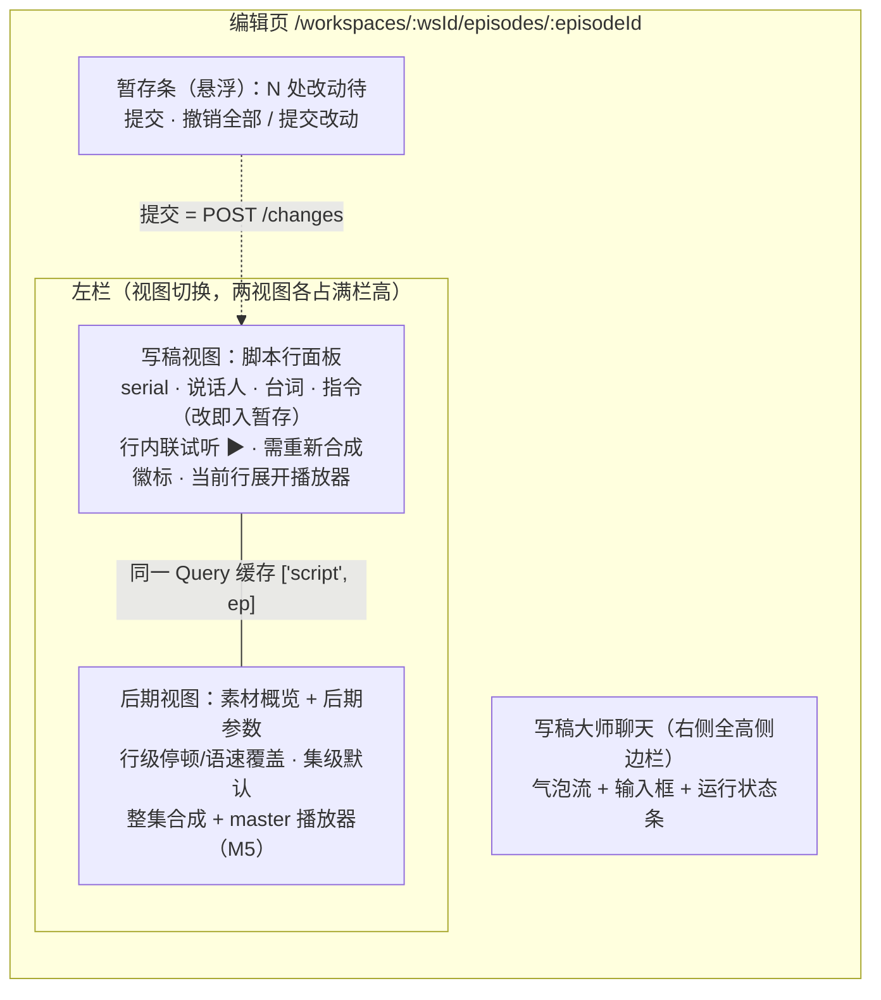

# 前端项目结构与页面拆分（Vite + React + shadcn/ui）

> 决议来源：[#20 前端项目结构与页面拆分](https://github.com/clerimia/AIPodCast/issues/20)（wayfinder 地图 #14）。
> 上界：正式项目（非原型）；只做三块——写稿大师聊天 / 音频工作区 / 工作间设置；时间线 UI、素材库、BGM 不做。
> 本文档是**前端结构方案**（计划层，plan not do），给实现阶段开工用；接口形状以 `docs/api-and-dataflow.md` 为准。

## 一句话

一个 Vite 应用落在仓库根的 `web/`，**路由上只有三个页面**：工作间列表（脚手架）、**编辑页**（左栏「写稿 / 后期」视图切换、右侧写稿大师聊天——CONTEXT.md 的「编辑页是用户的工作台」，#30 改同页视图切换）、工作间设置；数据层用 **TanStack Query 管全部 REST 服务端状态**（SSE 事件只负责触发缓存失效），**Zustand 只装两份纯客户端状态**（暂存门缓冲、写稿运行态），API 客户端是**手写类型的薄 fetch 封装**，SSE 用 fetch + ReadableStream 手解（POST 请求即流，EventSource 不可用）。

## 「三块」与路由的对应（先消歧）

CONTEXT.md：写稿大师是编辑页的 AI 会话，**编辑页是用户的工作台——上半区文本编辑、下半区音频工作区**。因此「三块页面」落成 **两个路由 + 一个脚手架页**，三块是编辑页内外的 feature 模块，不是三个路由：

| 路由 | 页面 | 包含的三块 |
|---|---|---|
| `/` | 工作间列表（脚手架） | 列工作间 / 建工作间（`GET/POST /workspaces`） |
| `/workspaces/:wsId` | **工作间页面**（#25 后新增：单集列表 + 建单集并进入；卡片点击即达） | 不属于三块，是工作间的落点页 |
| `/workspaces/:wsId/episodes/:episodeId` | **编辑页** | **写稿大师聊天**（右侧侧边栏）+ 左栏「写稿 / 后期」视图切换（#30），暂存条横跨两视图 |
| `/workspaces/:wsId/settings` | **工作间设置** | 节目元数据表单 + 说话人增删改 |

- `wsId` 进路由是为了导航（编辑页头部跳设置），不为取数——单集数据全部走 `/api/episodes/:episodeId/*`。
- 音频工作区不是独立路由：它是编辑页左栏的「后期」视图（行级停顿/语速覆盖、素材概览；单行试听在写稿视图的脚本行上；整集合成 / master 播放 + 行级高亮 M5 落）。

## 技术选型（骨架约定）

| 关注点 | 选型 | 理由 |
|---|---|---|
| 构建 | Vite 7 + React 19 + TypeScript（strict） | 已定栈；`@/` 别名指向 `src/`（shadcn 惯例） |
| 路由 | react-router v7（library 模式：`BrowserRouter` + `Routes`） | 三个页面无需 data router 的 loader/action；少一层概念 |
| 服务端状态 | **TanStack Query v5** | 脚本/说话人/产物都是 REST 缓存；轮询合成任务用 `refetchInterval`；SSE 的 `script:changed` → `invalidateQueries` |
| 客户端状态 | **Zustand**，仅两个 store | 暂存缓冲与写稿运行态都跨 feature 消费（脚本面板 ↔ 暂存条 ↔ 音频区），context + reducer 的 prop 钻取不值得 |
| 样式 | Tailwind CSS v4（CSS-first）+ shadcn/ui | 已定栈；组件生成进 `src/components/ui`，`cn()` 在 `src/lib/utils.ts` |
| API 客户端 | 手写类型 + 薄 fetch 封装（无 axios/无 codegen） | 端点 ~20 个、单用户本地应用，手写 `types.ts` 对照 `api-and-dataflow.md` 即可；后端同为 TS，若将来要共享类型再抽 `shared/`（#21 范畴） |
| SSE | `fetch` + `ReadableStream` 手解帧 | `POST writer/messages` 请求即流，`EventSource` 不支持 POST（#19 已定） |

## 目录结构

```
web/
  index.html
  package.json  vite.config.ts  tsconfig.json  components.json   # shadcn 配置
  src/
    main.tsx  App.tsx  index.css        # App：路由表 + QueryClientProvider + Toaster
    routes/
      HomePage.tsx                      # 工作间列表（脚手架，最简）
      EpisodePage.tsx                   # 编辑页：上下两半布局 + 暂存条 + 自动提交编排
      WorkspaceSettingsPage.tsx
    features/                           # 三块各一个模块，互不 import 对方内部
      writer-chat/                      # 写稿大师聊天（上半区左：会话）
        ChatStream.tsx  Composer.tsx  RunStatusBar.tsx  useWriterRun.ts
      script-panel/                     # 写稿视图：脚本行编辑 + 行内联试听
        ScriptLineList.tsx  ScriptLineRow.tsx  StagingBar.tsx
        staging.ts                      # 纯函数：ops 累积 + overlay 投影（可单测）
      audio-workspace/                  # 后期视图（#30 重构：不再镜像脚本行列表）
        PostView.tsx  PostLineRow.tsx  MasterPlayer.tsx
        useSynthesisJob.ts  useTranscriptHighlight.ts
      workspace-settings/
        ShowMetadataForm.tsx  SpeakerList.tsx  SpeakerDialog.tsx
    components/
      ui/                               # shadcn 生成件（button/input/textarea/select/
                                        #   dialog/dropdown-menu/badge/card/scroll-area/
                                        #   tooltip/label/sonner）
      script/                           # 跨半区共享的行内原子
        SerialBadge.tsx  SpeakerSelect.tsx  RestaleBadge.tsx  PauseSpeedSelect.tsx
    hooks/                              # 跨 feature 的数据 hooks（shared 才上浮）
      useScript.ts  useEpisode.ts  useWorkspace.ts  useArtifact.ts
    stores/                             # Zustand，仅两个
      staging.ts                        # 暂存门缓冲（见下节）
      writer-run.ts                     # 写稿运行态（run 状态/流式气泡/工具状态条）
    lib/
      api/
        http.ts                         # fetch 封装：JSON、错误形状 → ApiError(code,message)
        types.ts                        # 全部请求/响应类型（对照 api-and-dataflow.md 手写）
        keys.ts                         # Query key 工厂：['script',ep] ['workspace',ws]…
        workspace.ts  episode.ts  script.ts  writer.ts   # 按资源分组的端点函数
      sse.ts                            # SSE 帧解析（event:/data: → 类型化事件）
      utils.ts                          # cn()
```

分层规则：**feature 私有的放 feature 内，两个 feature 都用的上浮到 `components/` + `hooks/`**；脚本行数据被两个视图共同消费，唯一真相是 Query 缓存 `['script', episodeId]`，两视图各做投影、行身份用 `line.id` 对齐。

## 编辑页布局（写稿 / 后期同页视图切换，#30）



- 两视图**各自占满左栏高度**，行身份同源（`line.id`）；默认落在写稿视图。
- 分工按**动作归属**（#30）：单行试听是写作时的校对动作 → 内联在写稿视图的脚本行上（未合成→先合成再播；`<audio>` 只在当前试听行展开；暂存新增行不可试听；试听前 ensureCommitted 自动提交暂存）；停顿/语速是拼接层参数（单行试听听不出来）→ 只在后期视图调，行内只放「播」、不放直写参数，保持 ADR-0003（文本过门）/ ADR-0004（参数直写）的写语义分界在视觉上同样清晰。
- 文本侧行内编辑（台词/指令/说话人）**只改暂存，不改库**（ADR-0003）；后期视图的停顿/语速**直接 PATCH**、不经门（ADR-0004）。

## 暂存/确认门（ADR-0003）的前端交互

**暂存缓冲的规范形态 = `POST /changes` 的 ops 数组本身**。暂存不是一份"脏数据"，而是积累一次合法提交：

```ts
// stores/staging.ts（zustand，按 episodeId 区分）
type StagedOp = ChangeOp   // 直接复用 lib/api/types.ts 的 ops 联合类型
// state: { ops: StagedOp[], summary: string }
// actions: stageEdit(lineId, patch) / stageAdd(afterLineId, draft) /
//          stageDelete(lineId) / stageReorder(lineIds) / clearAll()
```

- **投影**：`staging.applyOps(base, ops)` 是纯函数——文本侧行列表渲染 = `['script',ep]` 缓存叠暂存 ops；行上给「待提交」标记。可单测，实现阶段照 ops 语义（add/edit/delete/reorder 顺序应用）写。
- **暂存条**：`ops.length > 0` 时悬浮显示「N 处改动待提交 · 撤销全部 / 提交改动」。「撤销全部」= `clearAll()`，界面回到服务器投影。
- **提交改动**：`POST /episodes/:id/changes { ops, summary }` → 成功后：清空 store → `invalidateQueries(['script'])` → 把响应的 `invalidatedLineIds` 写入缓存标记（写稿视图行上据此亮「需重新合成」，M4 消费；整集合成成功后清除）。
- **合成前自动提交**（ADR-0003 Consequences）：试听/整集合成的 mutation 前置检查暂存缓冲，非空则先 `POST /changes` 再继续，toast 提示「已自动提交暂存改动」。编排放在 `EpisodePage`（或共享的 `ensureCommitted()` 帮手），两个 mutation 各自调用。
- **与写稿大师并发的规则（MVP，无 base_version 守卫）**：SSE `script:changed` → 防抖重拉脚本；某行被 Agent 改过而用户已暂存该行时，**暂存保留（确认时人赢）**，行上提示「写稿大师也改过此行」。单用户 MVP 不做合并 UI。
- **暂停编辑窗口**：写稿运行中（`run:start` → `done`）输入框禁用；文本侧行编辑不锁（暂存本就隔离），但提交按钮在流式期间可用（提交只影响 DB 与下一回合上下文，不干扰当前 run）。

## 数据流约定（各 feature 怎么取数）

| 数据 | hook | 来源 | 消费方 |
|---|---|---|---|
| 脚本行 | `useScript(episodeId)` | `GET /episodes/:id/script` | 写稿视图 + 后期视图（同一缓存） |
| 单集详情/单集简介 | `useEpisode(episodeId)` | `GET /episodes/:id` | 编辑页头部、简介编辑 |
| 工作间 + 说话人 | `useWorkspace(wsId)` | `GET /workspaces/:wsId`（一次拉全） | 设置页、说话人下拉 |
| 产物 | `useArtifact(episodeId)` | `GET /episodes/:id/artifact` | master 播放器 + 高亮 |
| 合成任务 | `useSynthesisJob(jobId)` | `GET /synthesis-jobs/:jobId`，`pending/running` 时 `refetchInterval: 2000`，终态停 | 后期视图进度条（细粒度进度/取消 = #22 扩展点） |
| 写稿运行态 | `useWriterRun(episodeId)` | SSE 事件 → `stores/writer-run.ts` | 聊天流、状态条、暂存条提示 |

SSE 事件 → 缓存的桥（唯一允许直接摸 QueryClient 的地方，在 `stores/writer-run.ts` 内——运行态 store 与 SSE 流生命周期同一模块统管；QueryClient 单例在 `lib/query-client.ts`）：

- `script:changed` → **防抖 300ms** `invalidateQueries(['script', ep])`（一轮多工具只重拉一两次）；
- `tool:start/tool:end` → 写运行态 store（状态条文案）；
- `delta` / `message:end` → 流式气泡（运行态 store）；
- `done` → 关流 + 最终 `invalidateQueries(['script'])` + 恢复输入；
- `error` → toast + 关流。

**流生命周期与组件解耦**：SSE 流由 `stores/writer-run.ts` 模块级持有（`writerRunActions.send/stop`），导航离开编辑页（工作间主页/设置）流不断、store 持续更新，回来即续上；`useWriterRun` 只是纯 React 适配层（订阅 + history 装载）。服务端对客户端断连只停写流、run 照跑完（history 仍完整）。生成中回到页面跳过 history 装载（快照会覆盖 live 状态）。整页刷新仍会断流：run 在服务端跑完后经 history 可见（不重连进行中的流）。

## 边界与出界

- 正式项目从 `npm create vite@latest` 起步，不引入原型代码；`docs/prototypes/` 只作视觉参照（其「调音大师/定稿」词汇已废弃，以 CONTEXT.md 为准）。
- 时间线 UI、素材库/BGM、资源检索页不做；路由不留占位。
- 鉴权、多工作间权限、i18n、移动端适配：无。
- 后端端口在 `vite.config.ts` 的 `server.proxy['/api']` 指向 `VITE_API_ORIGIN`（默认 `http://localhost:3000`）；最终端口若 #21 另定，只改这一处。

## 实现阶段验证项（未确证 / 待验证）

1. 流式气泡的长文本性能：超长回合的 `delta` 高频追加，必要时气泡内容 `requestAnimationFrame` 合帧再 setState。
2. `<audio>` 拖动 + `timeupdate` 高亮的漂移：transcript 是确定性时间戳，若 mp3 seek 不准，改用 `currentTime` 对二分区间查找并节流。
3. 暂存 ops 在 `reorder` + `edit` 混合时的行 id 失效语义（编辑已删除的行应如何报错）：按 API 的 4xx 错误 toast 并回滚该 op，实现阶段对齐后端校验顺序。
