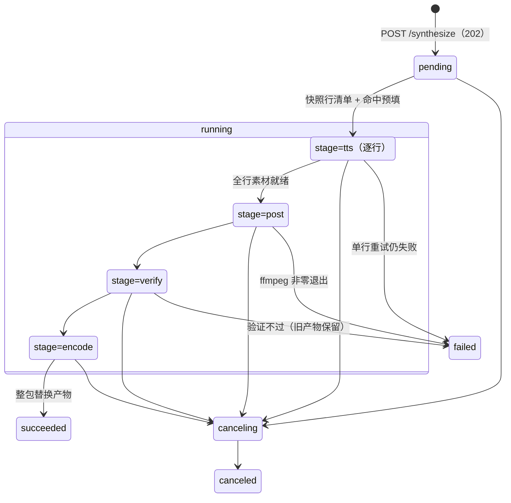

# 合成任务进度与取消（轮询增强 + 取消语义）

> 决议来源：[#22 合成任务进度与取消交互](https://github.com/clerimia/AIPodCast/issues/22)（wayfinder 地图 #14）。
> 上界：合成 = 确定性流水线非 AI 会话（ADR-0007）；验证失败保留旧产物不覆盖；试听（单行）同步已定（#19），不进本文；合成任务表在内存（#21）。
> 本文档是**进度与取消交互方案**（计划层，plan not do），扩展 `docs/api-and-dataflow.md` 的最小轮询形状（`status/stage/doneLines/totalLines` 全部保留，本文是其超集）；冲突处以本文为准。

## 一句话

整集合成的进度**继续走轮询**（不引入第二条 SSE）：`GET /synthesis-jobs/:jobId` 的载荷从「只报阶段」增强为「阶段 + 逐行」（累积 `doneLineIds` + 当前行），状态机增加 `canceling/canceled` 两个值；新增 `POST /synthesis-jobs/:jobId/cancel`（协作式取消：在途 TTS 请求即刻中止、ffmpeg 各步之间查旗标不杀进程）与 `GET /episodes/:id/synthesis-job`（页面重载后重新挂上活跃任务）；取消**保留已落盘素材**，旧产物永不因取消或失败被覆盖。

## 决策与理由

### 1. 推送方式：继续轮询，不上 SSE

- 进度是**累积状态**（`doneLines` 单调不减），轮询天然没有事件丢失、断线重连、补发的问题；SSE 的价值在不可重放的增量流（写稿的文本 delta），对进度条没有增量价值。
- 逐行事件的天然频率 ≈ 每 2–5 s 一条（40 行、分钟级任务），2 s 轮询粒度已等同；前端 TanStack Query `refetchInterval` 是 #20 已定的消费方式，轮询是它的主场。
- 不新增服务端机制面：SSE 进度需要事件总线 / 心跳 / 断线补发一整套；本地单用户应用不值。浏览器 HTTP/1.1 每主机连接预算留给写稿 SSE 与媒体 Range 流。
- **SSE 保持写稿会话独占**（#19 定位不变）：「唯一的 AI 会话是流式的，确定性流水线是轮询的」——这个分界是 ADR-0005 在传输层的镜像。

### 2. 细粒度 = 做在「行」上，不拆后期子步骤

`stage` 四档枚举（`tts|post|encode|verify`）**不变**——后期七步（atempo/gap/concat/loudnorm×2/时间戳/验证/编码）对用户都是「ffmpeg 在跑」，拆子步骤没有可操作的交互差异。细粒度做在**行**上：

- 任务启动时**快照行清单**（非删除行按 `serial` 序）并查素材命中：**命中的行立即计入完成**（复用即完成），未命中的行逐条 TTS、完成一条落盘一条计入一条。
- 前端因此能画：总进度条（`doneLines/totalLines`）、逐行 ✓（`doneLineIds`）、当前行转圈（`currentLine`）。

### 3. 取消语义：协作式 + 请求级中止；素材保留，产物不动

| 问题 | 决定 |
|---|---|
| 在途 TTS 请求 | `AbortController` **即刻中止**；该行不落盘、不计数，下次合成按未命中重做 |
| 未开始的 TTS 行 | 不再发起（逐行循环每行前查取消旗标） |
| ffmpeg 链 | **不杀进程**：各步之间查旗标，在途的一步跑完（秒级），其输出随任务废弃；取消延迟 ≤ 一步 ffmpeg |
| 已合成的素材 | **保留**（逐行原子写已落盘）——素材本就是 ADR-0006 的逐行复用单元，取消不销毁已完成的工作；下次合成（或试听）命中复用，几乎免费 |
| 旧产物 | 永不被取消/失败覆盖：产物整包替换只发生在验证通过后的最后一步（ADR-0007），取消路径到不了那一步 |
| 中间产物（concat 清单、临时 wav） | 进任务临时目录，任务进终态时清理 |

取消是**两段式**的：`POST cancel` → 任务置 `canceling`（前端显示「取消中…」）→ 旗标被检查到 / 在途请求中止后 → `canceled` 终态。

## 任务状态机与载荷契约



（管线顺序 `post→verify→encode` 照 ADR-0007 七步；`stage` 枚举值沿用 #19 的 `tts|post|encode|verify`，仅是标签、不含顺序语义。）

`GET /api/synthesis-jobs/:jobId` 返回（#19 最小形状的超集）：

```jsonc
{
  "jobId": "uuid",
  "episodeId": "uuid",
  "status": "pending|running|canceling|succeeded|failed|canceled",
  "stage": "tts|post|encode|verify",      // pending 时 null；终态定格在最后所处阶段
  "totalLines": 40,                        // 快照行数（非删除行）
  "doneLines": 12,                         // = doneLineIds.length（含命中复用）
  "doneLineIds": ["uuid", …],              // 累积；前端投影逐行 ✓
  "currentLine": { "lineId": "uuid", "serial": "L013" },  // | null
  "artifact": { /* 同 GET artifact，succeeded 时 */ },
  "error": null | {
    "code": "SYNTH_LINE_FAILED",           // | SYNTH_POST_FAILED | SYNTH_VERIFY_FAILED
    "message": "L013 合成失败：DashScope 请求超时",
    "lineId": "uuid",                      // 仅 SYNTH_LINE_FAILED 携带
    "serial": "L013"
  }
}
```

- **失败语义：单行 fail-fast**。TTS 单行失败先做**进程内重试 1 次**（2 s 退避，仅对超时 / 网络错误 / 5xx / 429；4xx 参数错误直接失败），仍失败即整任务 `failed`（`SYNTH_LINE_FAILED`，携带行）。不为失败任务继续烧后续行的 TTS——已落盘的素材仍在，重试整个任务时命中复用，代价低。
- `SYNTH_POST_FAILED`（ffmpeg 非零退出/超时）、`SYNTH_VERIFY_FAILED`（确定性验证不过，旧产物保留）不带行信息。
- #19 错误形状示例中的 `SYNTH_FAILED` 由这三个码取代。
- 未知/已丢失（重启后）的 jobId → `404 NOT_FOUND`。

## 端点增量（#22 新增，其余端点照 #19）

| 方法 | 路径 | 说明 |
|---|---|---|
| POST | `/api/synthesis-jobs/:jobId/cancel` | 请求取消：`pending/running` → `202` 任务快照（`status=canceling`）；已在 `canceling` → 幂等返回快照；终态 → `409 CONFLICT`；未知/丢失 → `404` |
| GET | `/api/episodes/:episodeId/synthesis-job` | 当前**活跃**任务（`pending/running/canceling`）快照，无则 `404`——页面重载后凭它重新挂上轮询 |

并发规则：

- **同一单集同时只允许一个活跃任务**：活跃期间再 `POST /synthesize` 或该集 `preview` → `409 CONFLICT`（合成进行中）。**跨单集**并发任务允许（TTS 是网络型、ffmpeg 是 CPU 型，任务间无共享可变状态——素材/产物都按单集隔离）。
- **合成期间脚本文本可改**（写稿大师不被合成阻塞）：任务按启动时快照跑；期间 `/changes` 对某行的作废照常生效，本次产物可能已含改动前音频，行上「需重新合成」标记如实反映，下次合成收敛。
- **进程重启丢任务句柄**（#21 既定，不翻）：活跃任务丢失后 active-job 端点与 `GET /synthesis-jobs/:jobId` 都 404，前端按「任务丢失」收场（停轮询、刷产物）；已落盘素材与旧产物完好。

## 前端消费（扩展 #20）

- `useSynthesisJob(jobId)`：`refetchInterval: 2000`，`status ∈ {pending, running, canceling}` 时轮询、终态停；收到 404 → 停轮询并 `invalidateQueries(['artifact'])`。
- 编辑页挂载时查 `useActiveSynthesisJob(episodeId)`（GET active-job），查到活跃任务则接管其 `jobId` 继续轮询——**刷新页面不丢进行中的合成**。
- 进度 UI（下半区音频工作区）：总进度条 `doneLines/totalLines` + 阶段文案（正在合成 L013… / 拼接与响度… / 校验… / 编码…）；行列表按 `doneLineIds` 打 ✓、`currentLine` 转圈。
- **取消按钮**（`running/canceling` 时可见）：点按 → `POST cancel` → 「取消中…」→ 终态 toast（已取消：已合成 N 行素材已保留 / 合成失败：L013…）；终态后 `invalidateQueries(['script'])` 让行素材状态对齐落盘现实。取消/失败后再点合成即重试（命中复用，便宜）。

## jobs.ts 升级（#21 预留位兑现）

任务表**仍是内存 `Map`**（不建 DB 表、不随重启持久——#21 决定不翻）。升级点 = 计划快照 + 逐行进度 + 取消控制：

```ts
type SynthesisJob = {
  id: string; episodeId: string;
  status: 'pending'|'running'|'canceling'|'succeeded'|'failed'|'canceled';
  stage: 'tts'|'post'|'encode'|'verify'|null;
  plan: string[];                       // 启动时快照的有序 lineIds
  doneLineIds: Set<string>;
  currentLine: { lineId: string; serial: string } | null;
  cancelRequested: boolean;
  abort: AbortController;               // 中止在途 TTS fetch
  artifact?: object; error?: object;
}
```

跑批循环与 post 流水线接收 `(job, signal)`，在**行间 / ffmpeg 步间**检查 `cancelRequested`；M6 落地内容即本文。

## 与 ADR / 边界的对齐

- **ADR-0007**：整包替换只在验证通过后的最后一步；取消/失败/验证不过 → 旧产物原样。本文把「保留旧产物」从验证失败扩展为一切非成功终态。
- **ADR-0006**：素材逐行独立落盘与复用，是「取消保留部分素材」的根据。
- **ADR-0005**：SSE 仍只属于写稿会话；合成是确定性流水线，用轮询——传输层分界与 AI/非 AI 分界一致。
- **#19**：最小轮询形状全保留，本文是其超集；`SYNTH_FAILED` 错误码细化为三个。
- **#20/#21**：`useSynthesisJob` 轮询消费与 jobs.ts 内存表照本文升级；落地期在 M6。

## 实现阶段验证项（未确证 / 待验证）

1. **TTS fetch 中止的清理路径**：`AbortController` 中止 DashScope 请求后不写文件、不计数、循环不因未处理 rejection 崩溃（素材只在完整收到 body 后经临时文件→rename 落盘）。
2. **TTS 单行重试的适用面**：超时/网络错误/5xx/429 重试 1 次、4xx 直接失败——与 M4 调通时核对到的 DashScope 错误码对齐。
3. **ffmpeg 协作取消的延迟实测**：post 各步必须是独立子进程调用（旗标落在步间）；长单集 loudnorm 两遍可能 10–30 s，若取消延迟超预期，再给在途步加进程终止 + 临时文件清理（备选方案，默认不做）。
4. **重启丢任务的收场**：404 路径前端停轮询 + 刷产物，不残留幽灵进度条。
